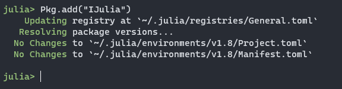

# Data wrangling in Julia
> Xử lý và biến đổi dữ liệu trên Julia


## Cài đặt

Bạn cần cài đặt Julia và setup Julia trên Jupyter Notebook để có thể thực hành với các notebooks ở đây.

### Tải và cài đặt Julia
Bạn có thể tải file về và cài đặt trên máy tính cá nhân [tại đây](https://julialang.org/downloads/)

**Version:**
Hiện Julia đã có version 1.10.0, tuy nhiên, để sử dụng được các thư viện một cách ổn định (hoặc để cài được thư viện), tốt nhất bạn nên sử dụng các version được xây dựng trước 1 thời gian như 1.8.x. Hiện với các notebooks và các thư viện được sử dụng đang chạy trên Julia 1.8.5


Tải các version cũ [tại đây](https://julialang.org/downloads/oldreleases/)

### Setup cho Jupyter Notebook
Bạn có thể đọc hướng dẫn cách setup Julia trên Jupyter Notebook như sau:
1. [Windows](https://datatofish.com/add-julia-to-jupyter/)
2. [Linux](https://docs.rc.fas.harvard.edu/kb/julia-with-jupyter-notebooks-on-odyssey/)

Về cơ bản, nếu bạn đã sử dụng Jupyter Notebook rồi thì bạn chỉ cần cài đặt thêm thư viện `IJulia` trên Julia, phần còn lại chỉ đơn giản là mở `jupyter notebook` ra là bạn có thể tạo 1 kernel trên Julia được:

```julia
using Pkg
Pkg.add("IJulia")
```


Sau đó, bạn có thể tạo được notebook vs kernel là julia.1.8.5:


**Lưu ý:**
Với các bạn đã làm quen với Jupyter Lab, với version hiện tại của Jupyter Lab và IJulia, tốt nhất là không sử dụng Jupyter Lab do IJulia không thể compile code được vs Jupyter Lab và kernel thường bị chết giữa chừng.

## Nội dung chính

Phần lớn nội dung của bài viết này sẽ bám sát với bài viết [data-wrangling-with-tidyverse](https://github.com/ddpham/data-wrangling-with-tidyverse) được viết trên R.

Nội dung chính của bài này bao gồm:
1. Giới thiệu về Pipe operator
2. Các phương pháp biến đổi dữ liệu cơ bản
3. Các phương pháp biến đổi dữ liệu nâng cao
